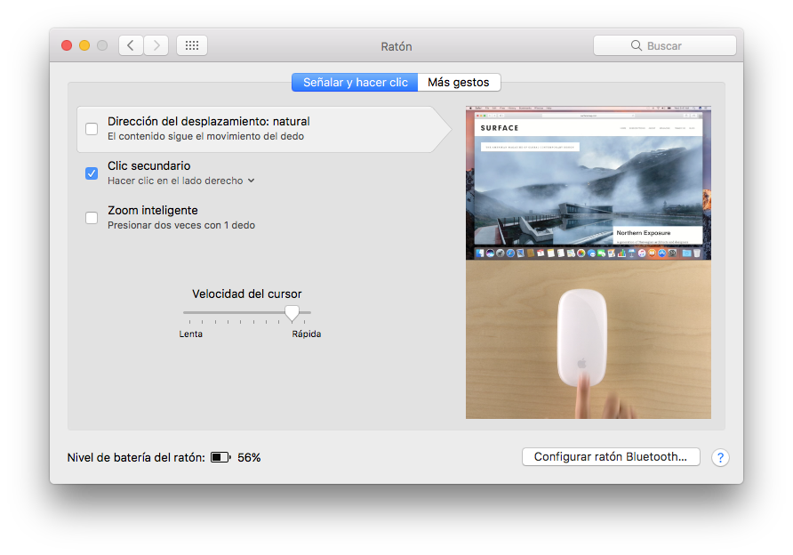
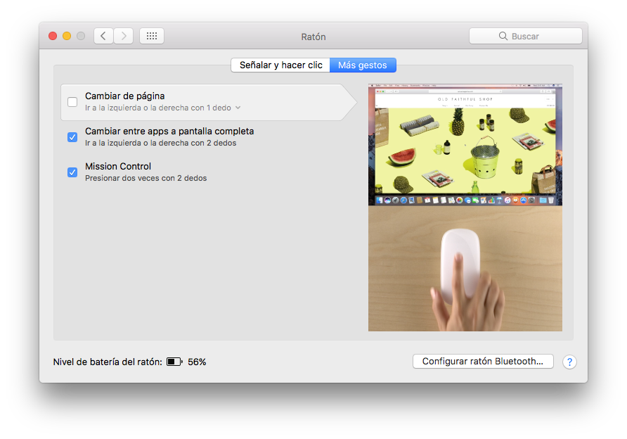
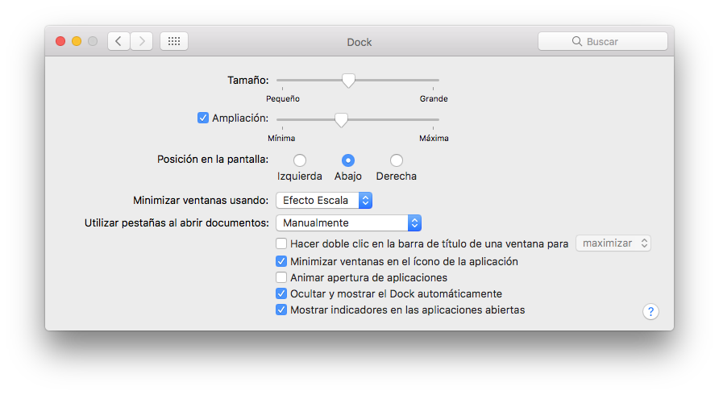
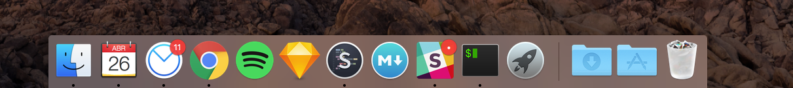
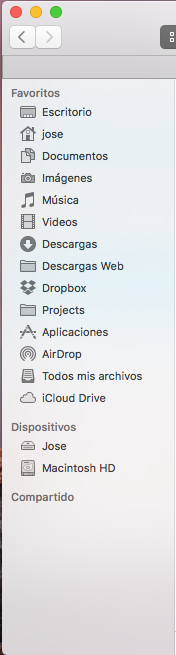
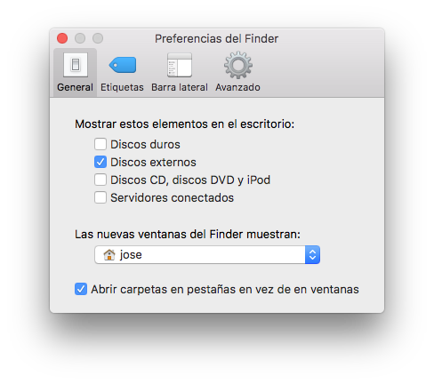
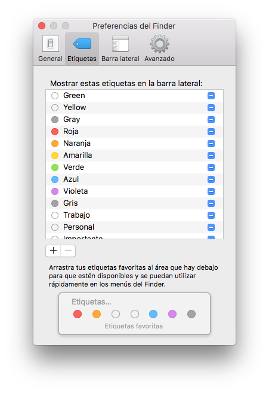
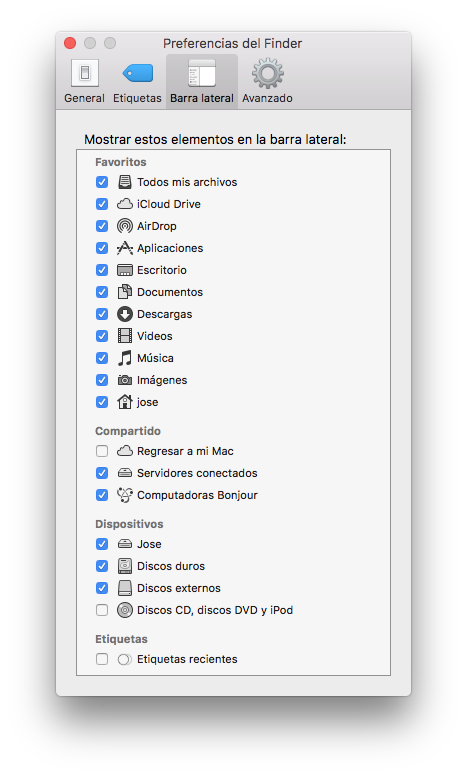
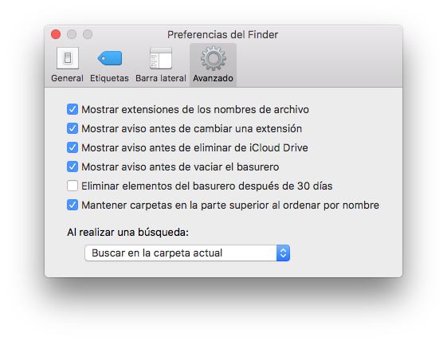
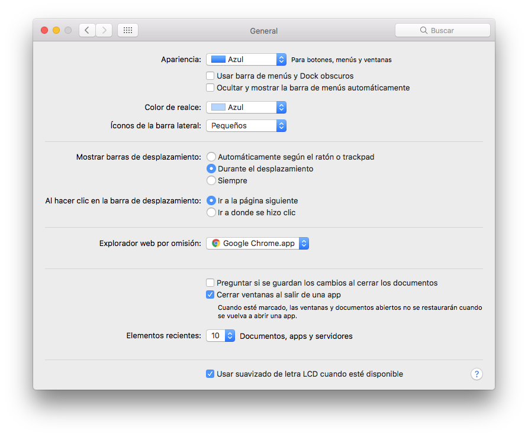

# System Preferences

First thing you need to do, on any OS actually, is update the system! For that: Apple menu () > About This Mac > Software Update.

Also upgrade your OS in case you want to work on the latest OS. Sierra is a free upgrade so please check that.

If this is a new computer, there are a couple tweaks you would like to make to the System Preferences. Feel free to follow these, or to ignore them, depending on your personal preferences.

## Users & Groups

- Login Options -> Change fast switching user menu to Icon
- Set up Password, Apple ID, Picture, etc.

## Trackpad

(TBD)

## Mouse

## Dock

## Finder

- Toolbar
- Sidebar
  - Make icons smaller
  - Set directories as follows:
    - Desktop
    - Home
    - Documents
    - Images
    - Music
    - Video
    - Downloads
    - Web Downloads
    - Dropbox
    - Projects
    - Apps
    - AirDrop
    - All my files
    - iCloud Drive
  - Remove tags
  - New finder window to open in the home directory

## General

## Menubar

- Remove the display icon
- Add the audio, wifi and bluetooh
- Change battery to show percentage symbols

## Spotlight

- Uncheck fonts, images, files etc.
- Uncheck the keyboard shortcuts as we'll be replacing them with Alfred.

## Accounts

- Add an iCloud account and sync Calendar, Find my mac, Contacts etc.

  
---

Made with ❤️ by [chepetime](https://github.com/chepetime) @ Mexico City